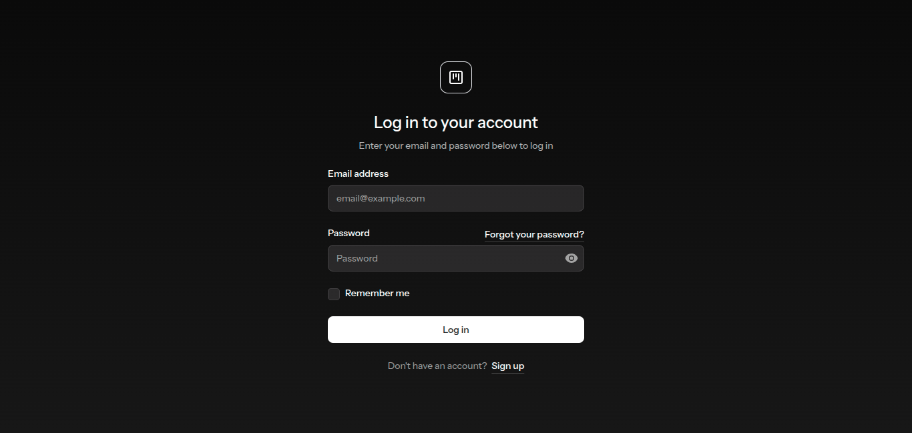
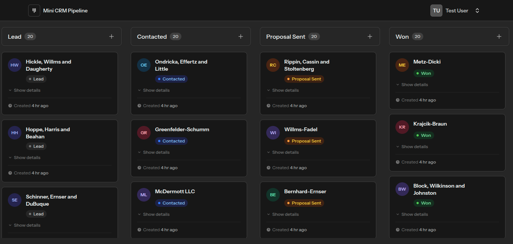
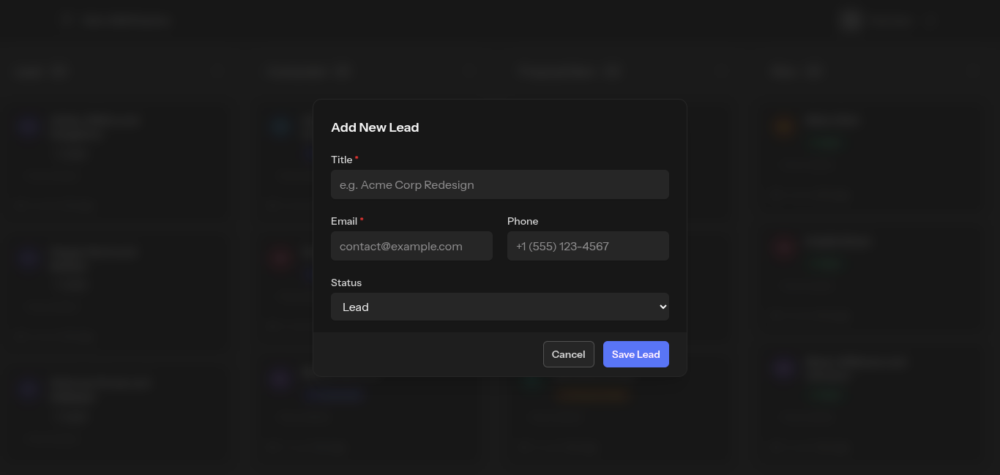
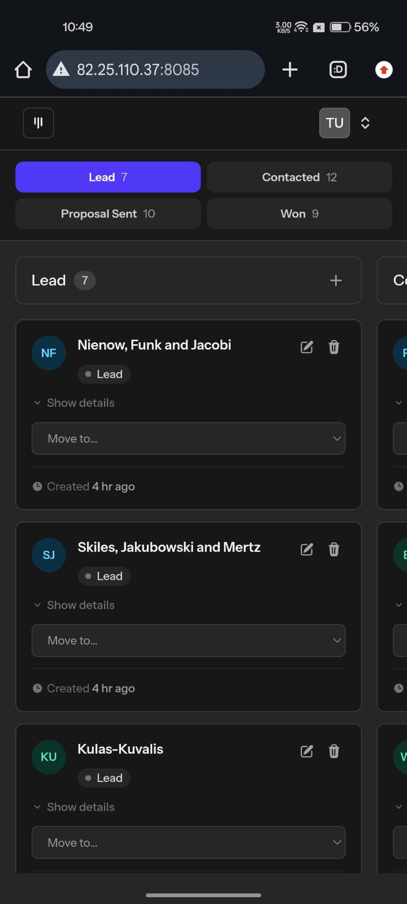

# Mini CRM Pipeline

Customer Relationship Management (CRM) pipeline application built with Laravel and Livewire.

---

## 🌐 Live Demo

http://82.25.110.37:8085/

> Note: The application is hosted on a temporary VPS environment for evaluation purposes.

---

## 🛠 Tech Stack

### Backend
- PHP `^8.3`
- Laravel `^13.7`
- Livewire `^4.1`
- Livewire Flux `^2.13.1`
- Laravel Fortify `^1.34`

### Frontend
- Tailwind CSS `^4.0.7`
- Alpine.js `^3.15.12`
- Alpine Persist Plugin
- Alpine Collapse Plugin
- Vite `^8.0.0`

### Database
- MySQL

### Testing & Code Quality
- Pest PHP `^4.7`
- Laravel Pint `^1.27`
- Laravel Pail
- FakerPHP

---

## 📸 Screenshots

### Login Page



### CRM Pipeline Board



### Add Lead Modal



### Mobile Responsive View



---

## 📋 Prerequisites

Ensure your environment includes:

- PHP `>= 8.3`
- Composer
- Node.js & npm
- MySQL

---

# ⚙️ Installation & Setup

## 1. Clone Repository

```bash
git clone https://github.com/pra7iksinh/mini-crm-pipeline.git

cd mini-crm-pipeline
```

---

## 2. Install Dependencies

```bash
composer install

npm install
```

---

## 3. Configure Environment

```bash
cp .env.example .env

php artisan key:generate
```

Update your `.env` file with your database credentials.

Example:

```env
DB_CONNECTION=mysql
DB_HOST=127.0.0.1
DB_PORT=3306
DB_DATABASE=mini_crm_pipeline
DB_USERNAME=root
DB_PASSWORD=
```

---

## 4. Run Database Migrations

```bash
php artisan migrate
```

---

## 5. Seed Demo Data

```bash
php artisan db:seed
```

This creates:
- demo user
- sample leads across all pipeline stages

### Demo User Credentials

| Field    | Value              |
|----------|--------------------|
| Email    | test@example.com   |
| Password | Test105*           |

---

## 6. Build Frontend Assets

```bash
npm run build
```

---

## 7. Start Development Environment

```bash
composer run dev
```

Or run services separately:

```bash
php artisan serve

npm run dev
```

---

# 🧪 Running Tests

Run the automated test suite using Pest PHP:

```bash
composer run test
```

---

# 🎨 Code Formatting

Format the codebase using Laravel Pint:

```bash
composer run lint
```

Check formatting without modifying files:

```bash
composer run lint:check
```